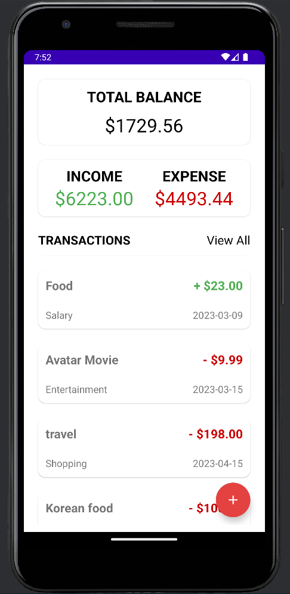
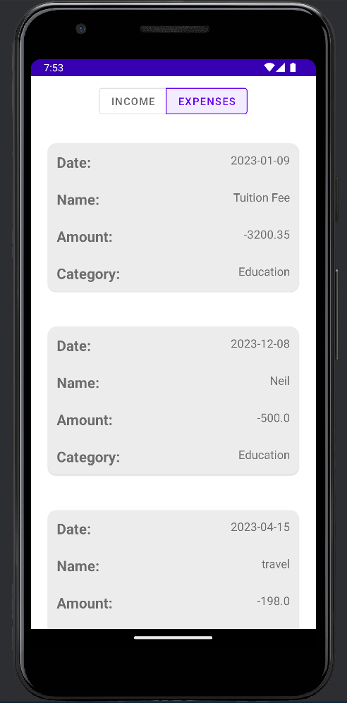
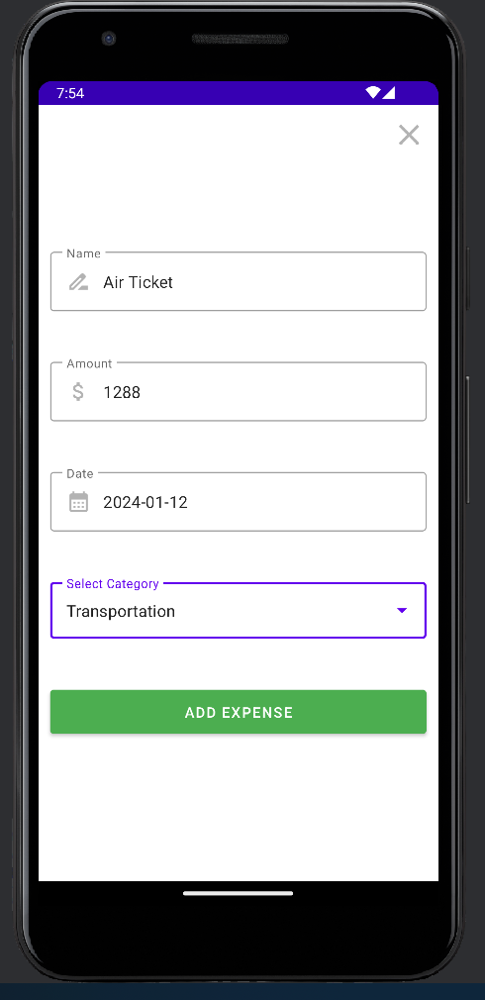

# Expense Tracker

**Your Personal Finance Companion**

Manage your finances effortlessly with Expense Tracker, the ultimate app for keeping tabs on your expenses. This user-friendly application empowers you to take control of your spending habits, providing a seamless and intuitive experience.

## Key Features

- **📊 Categorized Expense Tracking:**
  Easily categorize your expenses under various tags such as groceries, transportation, entertainment, and more. Gain insights into your spending patterns and make informed financial decisions.

- **📆 Date-wise Expense Recording:**
  Track expenses on a daily, weekly, or monthly basis. Effortlessly log your transactions, ensuring a clear overview of your financial activity over time.

- **💵 Budget Management:**
  Set personalized budgets for different expense categories. Receive timely notifications and stay within your financial limits to achieve your savings goals.

- **📈 Visual Reports and Insights:**
  Access detailed visual reports and graphs to understand your expenditure trends. Visualize your financial data and identify areas for potential savings.

- **🔒 Secure and Private:**
  Rest easy knowing that your financial data is secure. Expense Tracker prioritizes your privacy, utilizing robust security measures to safeguard your sensitive information.

## 📸 **App Screenshots**

<div align="center">
  
  
  
</div>

## Getting Started

1. **Clone the Repository:**
```
https://github.com/neilcao777/ExpenseTracker.git
```

2. **Installation:**
- Open the project in Android Studio.
- Build and run the app on your Android device or emulator.

3. **Usage:**
- Follow the on-screen instructions to set up your expense categories and start tracking your spending.

---

Whether you're a meticulous budget planner or just starting your financial journey, Expense Tracker is your reliable companion for achieving financial wellness. Download now and embark on a path towards smarter money management.

